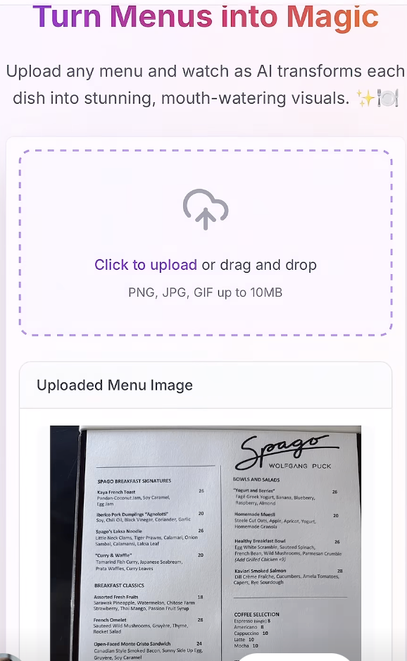

# 🍽️ Picto Dish Magic

**Transform any text menu into a visual feast with AI-generated food photography**

[](https://24b169c5-466f-4a1b-9723-fd0ed884a615.lovableproject.com)
[](https://lovable.dev)

> Can't decide what to order? Upload any menu without pictures and get it back with stunning AI-generated visuals of every dish!



## ✨ Features

- **🔍 AI Menu Analysis**: Automatically extracts dish names and descriptions from uploaded menu images
- **🎨 AI Image Generation**: Creates stunning, realistic food photography for every dish using advanced AI models
- **🌐 Multilingual Support**: Fully supports English and Russian languages with automatic detection
- **📱 Responsive Design**: Beautiful, mobile-first interface that works seamlessly across all devices
- **⚡ Fast Processing**: Parallel image generation for quick results
- **🎯 Smart OCR**: Advanced optical character recognition to read even complex menu layouts
- **💫 Beautiful UI**: Modern design with smooth animations and intuitive user experience

## 🚀 How It Works

1. **📤 Upload**: Simply upload a photo of any text-only menu
2. **🤖 AI Analysis**: Our AI reads and understands the menu, extracting dish information
3. **🎨 Image Generation**: AI creates beautiful, realistic images for each dish
4. **🍽️ Visual Menu**: Get your menu back with stunning visuals to help you decide what to order!

## 🔒 Security & Architecture

### Why Supabase?

This application leverages **Supabase** as its backend-as-a-service platform for enhanced security and performance:

- **🔐 Secure API Management**: OpenAI and Replicate API keys are stored as encrypted secrets, never exposed in client-side code
- **🛡️ Edge Functions**: Menu analysis and image generation happen server-side via Supabase Edge Functions
- **🚀 Serverless Architecture**: No server maintenance required, with automatic scaling and global CDN
- **🔒 Environment Isolation**: Production and development environments are completely separated
- **📊 Built-in Analytics**: Monitor API usage and performance through Supabase dashboard
- **⚡ Edge Computing**: Fast response times with globally distributed edge functions

## 🛠️ Tech Stack

### Frontend
- **React 18** - Modern React with hooks and concurrent features
- **TypeScript** - Type-safe development for better code quality
- **Tailwind CSS** - Utility-first CSS framework with custom design system
- **Vite** - Lightning-fast build tool and development server
- **Lucide React** - Beautiful, customizable icon library
- **React Router** - Client-side routing for smooth navigation

### Backend & AI Integration
- **Supabase Edge Functions** - Serverless functions for secure API integration
- **OpenAI GPT-4 Vision** - Advanced AI model for menu text extraction and analysis
- **Replicate AI** - High-quality food image generation using FLUX models
- **Supabase** - Backend-as-a-Service platform for secure API management

### UI/UX Libraries
- **Radix UI** - Accessible, unstyled UI primitives for robust components
- **Class Variance Authority** - Type-safe component variants system
- **Sonner** - Beautiful toast notifications for user feedback
- **React Hook Form** - Performant forms with built-in validation
- **TanStack Query** - Powerful data fetching and caching library

## 🌍 Internationalization

The app supports multiple languages with automatic detection:

- **English** - Full interface and processing support
- **Russian** - Complete localization including menu analysis
- **Auto-detection** - Automatically detects menu language for optimal processing

## 🎯 AI Models Used

- **OpenAI GPT-4 Vision** - For menu text extraction and dish analysis
- **FLUX.1 (via Replicate)** - For high-quality food image generation
- **Custom OCR Pipeline** - Optimized for menu text recognition

## 🚀 Getting Started

### Prerequisites

- Node.js 18+ 
- npm or yarn
- Supabase account (for backend services)

### Installation

1. **Clone the repository**
   ```bash
   git clone <your-repo-url>
   cd picto-dish-magic
   ```

2. **Install dependencies**
   ```bash
   npm install
   ```

3. **Set up Supabase**
   - Create a new Supabase project
   - Configure environment variables
   - Deploy the included Edge Functions

4. **Start development server**
   ```bash
   npm run dev
   ```

5. **Open your browser**
   Navigate to `http://localhost:5173`

## 📱 Mobile App

This project also supports mobile deployment through Capacitor:

- **iOS & Android** ready with camera integration
- **Native camera access** for menu photo capture
- **Optimized performance** for mobile devices

## 🔧 Configuration

The app uses Supabase Edge Functions for secure API integration. Key configuration files:

- `supabase/functions/openai-chat/` - Menu analysis function
- `supabase/functions/generate-dish-images/` - Image generation function
- `capacitor.config.ts` - Mobile app configuration

## 🎨 Design System

Built with a comprehensive design system featuring:

- **Semantic color tokens** for consistent theming
- **Dark/light mode support** with smooth transitions
- **Responsive breakpoints** for all screen sizes
- **Custom animations** and micro-interactions
- **Accessible components** following WCAG guidelines

## 📄 License

This project is licensed under the MIT License - see the [LICENSE](LICENSE) file for details.

## 🙏 Acknowledgments

- **Lovable** for the incredible AI-powered development platform
- **OpenAI** for providing GPT-4 Vision API for menu analysis
- **Replicate** for high-quality AI image generation models
- **Supabase** for the secure, scalable backend infrastructure

---

**🍽️ Made with appetite for great food photography and modern web technologies 🚀**

[Try Live Demo](https://24b169c5-466f-4a1b-9723-fd0ed884a615.lovableproject.com) | [Report Bug](https://github.com/yourusername/picto-dish-magic/issues) | [Request Feature](https://github.com/yourusername/picto-dish-magic/issues)